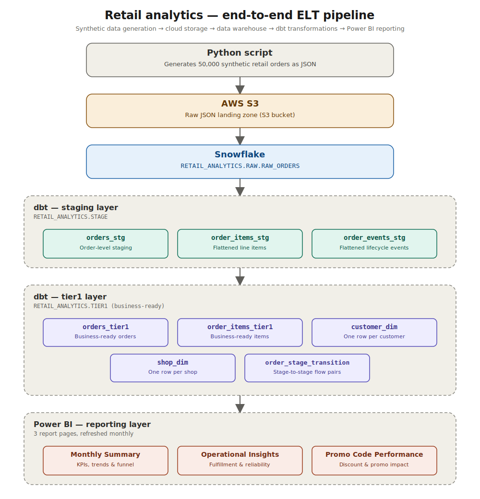
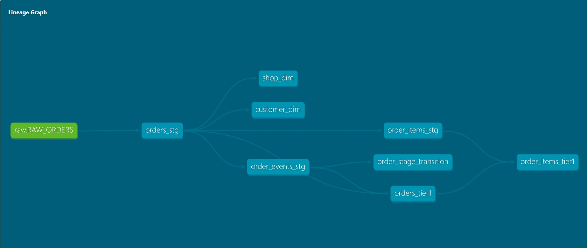
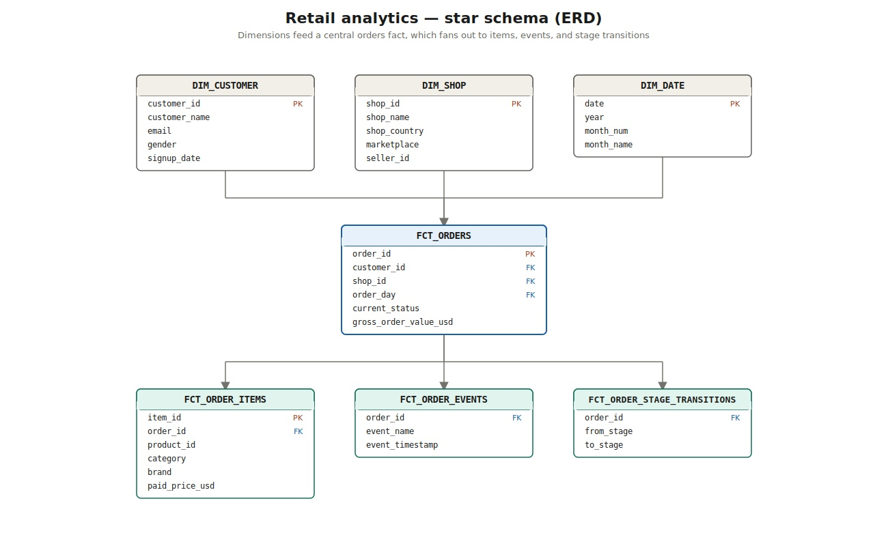

# 🚀 Retail Analytics ELT Pipeline

> **An end-to-end Retail Analytics Platform built using Python, AWS S3, Snowflake, dbt, SQL, and Power BI.**

This project demonstrates a complete modern analytics engineering workflow—from generating raw retail data (JSON) to building production-ready data models and delivering interactive business dashboards.

It showcases how raw transactional data (JSON) can be transformed into trusted, analytics-ready datasets using industry-standard ELT practices.

---

## 📊 Dashboard Preview

  

---

## ✨ Project Highlights

- 📦 Generated **50,000+ synthetic retail orders** using Python
- ☁️ Built an ELT pipeline using **AWS S3 → Snowflake → dbt**
- 🏗️ Designed a dimensional data model using **fact and dimension tables**
- 🧪 Implemented **dbt tests** for data quality and model validation
- 📈 Developed **three interactive Power BI dashboards** for executive and operational reporting
- ⚡ Automated business transformations using modular dbt models
- 📊 Delivered actionable business insights across revenue, fulfillment, promotions, and customer analytics

---
## 🏗️ Architecture

The project follows a modern ELT architecture where raw retail data is generated, ingested into Snowflake, transformed using dbt, and consumed through interactive Power BI dashboards.

  

---

## 🛠️ Technology Stack

| Layer | Technologies |
|--------|--------------|
| Programming | Python |
| Storage | AWS S3 |
| Data Warehouse | Snowflake |
| Data Transformation | dbt, SQL |
| Data Modeling | Star Schema |
| Visualization | Power BI |
| Version Control | Git & GitHub |

---

## 🔄 Project Workflow

The project follows a modern **ELT (Extract, Load, Transform)** architecture, where raw transactional data is first loaded into the data warehouse and then transformed into analytics-ready datasets.

### Workflow

1. **Data Generation**
   - Generated a synthetic retail dataset (~50,000 orders) using Python.
   - Simulated customers, products, shops, promotions, and order lifecycle events.

2. **Raw Data Storage**
   - Uploaded the generated JSON dataset to Amazon S3.
   - Used S3 as the landing zone for raw data.

3. **Data Warehouse**
   - Loaded raw JSON into the Snowflake **RAW** schema.
   - Stored nested data using the VARIANT data type.

4. **Data Transformation**
   - Built modular dbt models to flatten nested JSON.
   - Standardized and cleaned the data.
   - Applied business rules and revenue calculations.

5. **Analytics Layer**
   - Created dimensional models optimized for reporting.
   - Built reusable fact and dimension tables.

6. **Business Intelligence**
   - Connected Power BI directly to Snowflake.
   - Developed interactive dashboards for executive reporting and operational analytics.

---

## 🌳 dbt Model Lineage

The project uses **dbt** to organize transformations into modular staging and business layers. The lineage graph below illustrates how raw data flows through the transformation pipeline before being consumed by Power BI.

    

### Transformation Layers

- **RAW**
  - `RAW_ORDERS`

- **Staging**
  - `orders_stg`
  - `order_items_stg`
  - `order_events_stg`

- **Business Layer**
  - `customer_dim`
  - `shop_dim`
  - `orders_tier1`
  - `order_items_tier1`
  - `order_stage_transition`

This layered approach improves modularity, testing, maintainability, and reusability across the analytics pipeline.

---

## ⭐ Data Model

The reporting layer follows a **star schema** design, separating dimensions from facts to improve query performance and simplify analytical reporting.

    

### Fact Tables

- **Orders**
- **Order Items**

### Dimension Tables

- Customer
- Shop
- Date

The dimensional model enables fast aggregations, reusable metrics, and scalable reporting across Power BI dashboards.

---

## 📈 Interactive Business Dashboards

The Power BI report is organized into three interactive dashboard pages, each designed for a different business audience. Together, they provide executive-level KPIs, operational performance monitoring, and promotion effectiveness analysis.

---

### 📊 Dashboard 1 — Monthly Summary

    

This dashboard provides a high-level overview of business performance through key KPIs and executive metrics.

#### Key Insights

- Revenue and Order KPIs
- Month-over-Month Performance
- Order Status Funnel
- Gross-to-Net Revenue Bridge
- Daily Order Heatmap
- Interactive Month Filter

#### Business Value

This page enables executives to quickly monitor overall business health, identify operational bottlenecks, and track monthly performance trends.

---

### ⚙️ Dashboard 2 — Operational Insights

    

This dashboard focuses on operational efficiency and fulfillment performance across different business dimensions.

#### Key Insights

- Fulfillment Reliability by Marketplace
- Top Performing Product Categories
- Revenue by Country
- Gross Margin Across Brands
- Interactive Drill-down Analysis

#### Business Value

Operations and category managers can identify high-performing marketplaces, profitable brands, and geographic opportunities while monitoring fulfillment quality.

---

### 🎯 Dashboard 3 — Promotion Performance

    

This dashboard evaluates promotional campaigns by measuring revenue contribution, margins, cancellations, returns, and individual promo code performance.

#### Key Insights

- Revenue vs Gross Margin
- Order Outcome by Promotion Usage
- Top Revenue Generating Promo Codes
- Promotion Performance Summary
- Discount Impact Analysis

#### Business Value

Marketing teams can evaluate campaign effectiveness, identify high-performing promotion codes, and balance customer acquisition with profitability.

---

## 💡 Business Insights Delivered

The project answers several real-world retail analytics questions, including:

- Which marketplaces have the highest fulfillment success rate?
- Which product categories generate the highest revenue?
- Which brands contribute the strongest gross margins?
- How do promotions influence revenue and profitability?
- Which promotion codes generate the highest sales?
- How does revenue change after discounts, returns, and cancellations?
- Which countries contribute the most revenue?
- How do order volumes fluctuate throughout the month?
- What percentage of orders successfully reach delivery?

These insights help business stakeholders make informed decisions across operations, marketing, finance, and executive leadership.

---